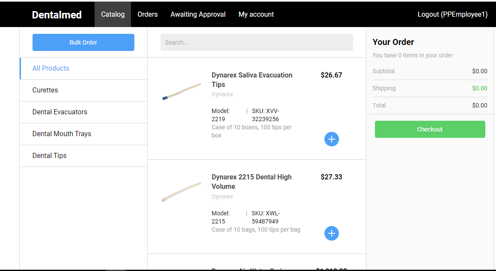
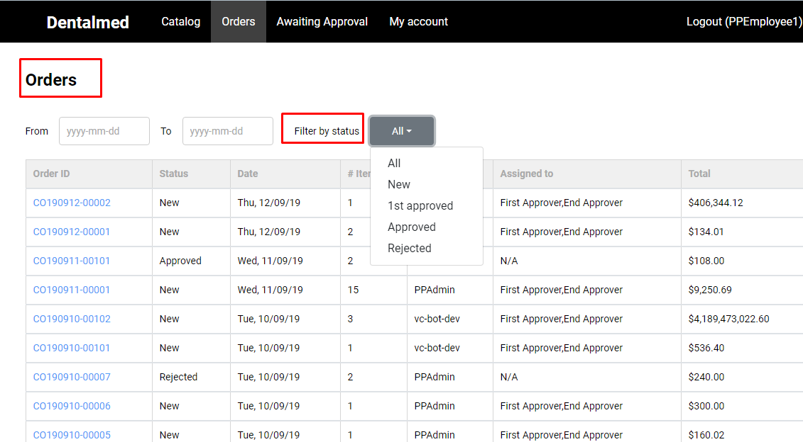
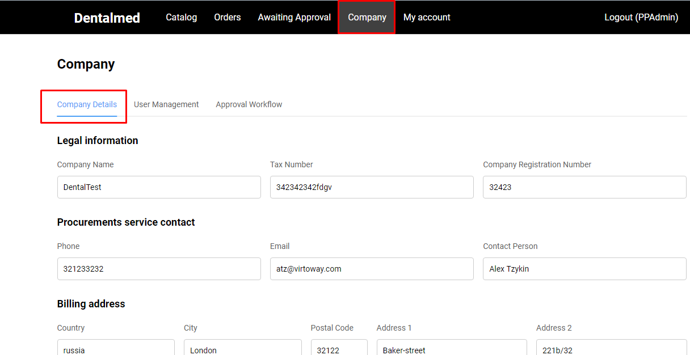

# Procurement Portal Theme

## Overview

Procurement Portal Theme is a Demo version of a Product that will demonstrate to potential Customers the capabilities of using Virto Commerce for creating dedicated stores for their clients that are supposed to be used as mono-supplier eProcurement Systems.

The Procurement Portal is consisted of a back-end platform that enables deliver the workflow functionality needed on Storefront side.

## Functional Possibilities

1. Procurement portal for B2B interaction;
1. User login page;
1. User Management (create, edit and delete users);
1. User Roles Management (create,edit and delete roles);
1. Order Management;
1. Order approval workflow;
1. Bulk Order Management;
1. Checkout without payment;
1. Invoice generating.

## Catalog Page

Once the user is logged in, the system displays the 'Catalog' page with ALL Products by default.

The user can use the 'Categories' tabs, located on the left side of the page, to navigate through different product categories.

Using the '+' buttons next to each product, the user can add the selected products to his Active Order.

The 'Bulk Order' button is used to navigate to the 'Bulk Order Pad'.

### Scenarios

[Create Active order](/docs/create-active-order.md)

[Remove Products From Order](/docs/remove-products-from-order.md)

[Bulk Order](/docs/bulk-order.md)

## Orders Page

The Orders page displays a table with a list of orders in different statuses and shows the following order information:

1. Order ID- link. By clicking this link the system opens the 'Order Details Information' window;
1. Status:

    1. New
    1. Rejected
    1. Approved
1. Date;
1. Items;
1. Created by;
1. Assigned to;
1. Total (cost).

The Orders page contains the following filters:

1. Filter by Status;
1. Filter by date range.

## Awaiting Approval Page

On the 'Orders Awaiting Approval' page only orders that should be approved according to the Approval workflow, are displayed. The page displays the same table and the same filters as 'Orders' page.

The 'Awaiting Approval' page is visible only to users with the role 'Approver'.

### Scenarios

## Company Page

The Company page is visible only for a user with an Admin role and is consisted of three tabs:

1. Company Details;
1. User Management;
1. Approval Workflow.

The 'Company Details tab is displayed by default when the user navigates to 'Company' page.

### Scenarios

[Add/ Update Company Details](/docs/company-details.md)

[User Management](/docs/user-management.md)

[Approval Workflow](/docs/approval-workflow.md)