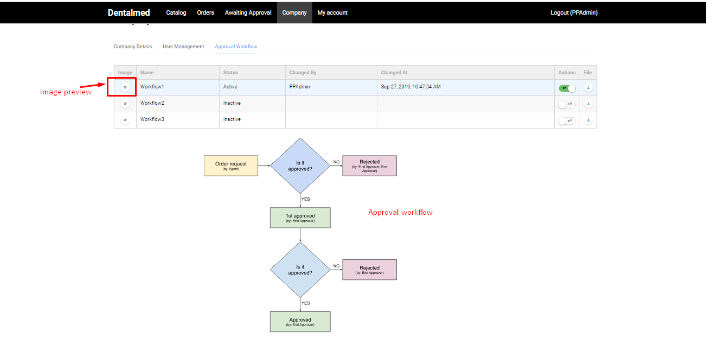

# Approval Workflow

## Activate Approval Workflow

In order to activate the Approval Workflow in the system, the admin should first upload a valid JSON file that contains Approval Workflow rules. 

**Important!** In the first version of the product the json file will be hard-coded.

The admin should create a valid json file that contains the approval workflow needed.

In order to activate the approval workflow the admin should go through the following steps:

1. Open Company page->Approval workflow;
1. On 'Approval workflow' page the following will be displayed:

    1. A table with the list of approval workflows and possibility to activate and deactivate them;
    1. Diagram of the current approval workflow.
1. The admin selects a workflow from the list and activates it using the switch button.

## Deactivate Approval Workflow

1. The admin selects the current active approval workflow from the list and switches the button to 'off';
1. The system will display a notification and prompt the user to confirm deactivation;
1. The user confirms the deactivation and the approval workflow will be deactivated. In this case no approval workflow will be required after the checkout.

!**Important** The current workflow can be deactivated only if ALL orders in the system are in new, completed or rejected status. In case there is at least one order, which is still 'in progress', the approval workflow can not be deactivated or changed.

### Workflow File Structure

{

"ImageUrl": "themes/assets/images/workflow2.svg", 

"States": [

{

"Name": "New",

"IsInitial": true,

"PermittedTransitions": [

{

"ToState": "1st approved",

"Trigger": "1st Approve",

"Roles": [ "Owner" ]

},

{

"ToState": "Rejected",

"Trigger": "Reject",

"Roles": [ "Owner", "Admin" ]

}

]

},

{

"Name": "1st approved",

"PermittedTransitions": [

{

"ToState": "Approved", 

"Trigger": "Approve", 

"Roles": [ "Admin" ] 

}, 

{ 

"ToState": "Rejected", 

"Trigger": "Reject", 

"Roles": [ "Owner", "Admin" ] 

} 

] 

}, 

{ 

"Name": "Approved", 

"IsFinal": true 

}, 

{ 

"Name": "Rejected", 

"IsFinal": true 

} 

] 

} 

**ImageUrl**  - a local path to SVG image of the workflow.

**"States"** - An array of states which are available for specific roles.

**"Name"** - A name of the status. Uses for setting the status.

**"IsInitial"** - This is the first state in our workflow. If our workflow state has been marked as "IsInitial": true then newly created orders will receive this status automatically. Also, if we trying to change or deactivate the current workflow and we already have the orders which are in this state then eventually this orders will be skipped by system.

**"PermittedTransitions"** - An array of permitted status transitions shows us the set of transitions among our workflow statuses, also the roles which are used to seeing these transitions.

**ToState** - Here we must set the exact name of the order status which is described for each status in field "Name".

**"Trigger"** - In this field, we place the name of the button that will be shown for changing order status in order details page.

**"Roles"** - An array of roles that are permitted for the current status transition.

We should use unique names for each role name in the whole workflow JSON file.

**"IsSuccessful"** - This flag shows us the fact that we should show the "Invoice" button on the order details page. If during perform our workflow we reach the status with this flag then the appropriate button will be shown.

**"IsFinal"** - As with "IsInitial" the "IsFinal" tells us that this order state (and the order eventually) will be excluded from the validation process during we trying to change or deactivate the current workflow.

**"OrderCreatorRoles"** - An array of roles for order creators. Here we should place the role names which should be used only for the order creation process. If this role assigned to a user then this user will be able to create new orders.

