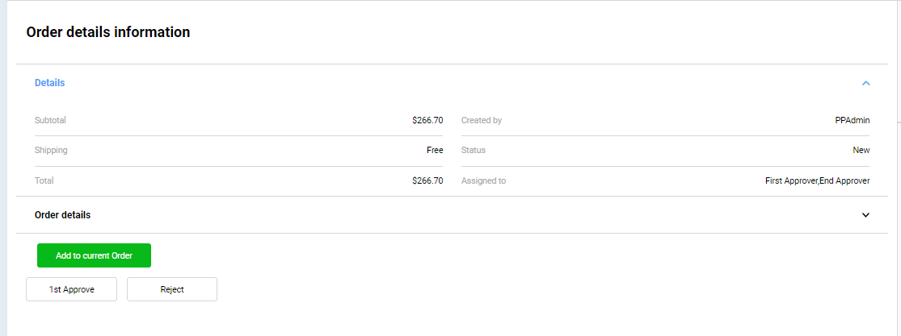
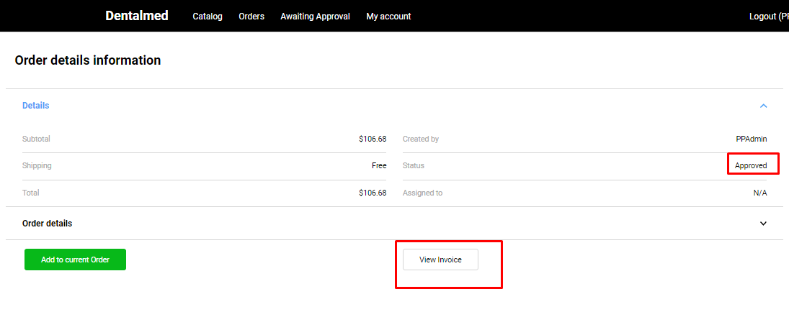
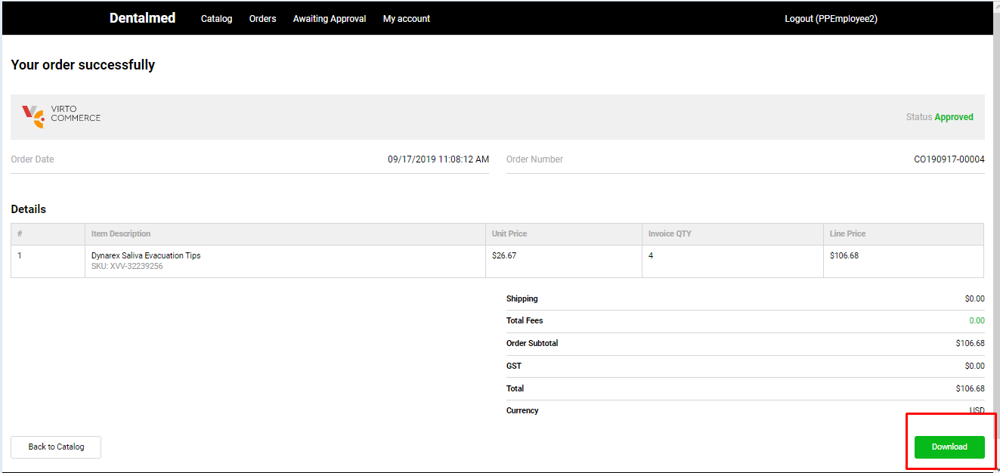

# Order Approval

## Approve Order

A user with the role 'Approver' can view on 'Awaiting approval' page the orders that should be approved according to the Approval workflow.

1. The user navigates to 'Awaiting approval' page, selects the order and clicks on the order's ID;
1. The system opens the 'Order details information' window;

   1. 'Approve' button is active;
   1. 'Reject' button is active;
   1. 'Add to current order' button is active.
1. The approver clicks the 'Approve' button;
1. After the first approve the system may respond in two possible ways:

   1. If according to the approval workflow there should be only one approver, the system will generate an invoice and the order will appear on order creator's side as 'Approved';
   1. If according to the approval workflow there should be more than one approver, the system will assign the order to the next approver.

## Reject Order

The order can be rejected by the approver if for some reasons it can not be approved. The rejected order will be returned back to the order created and will appear on his 'Orders' page as 'Rejected'
