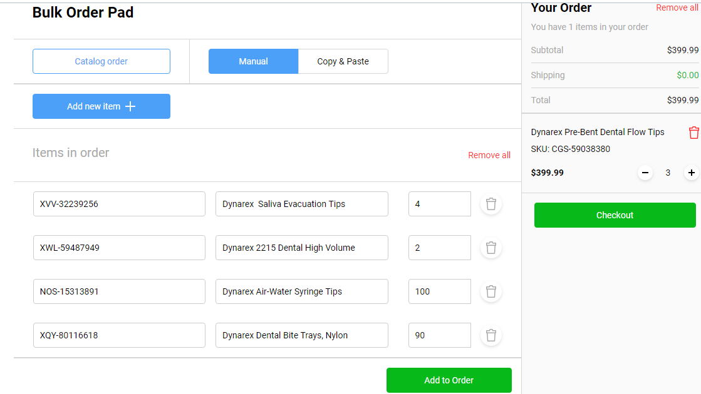
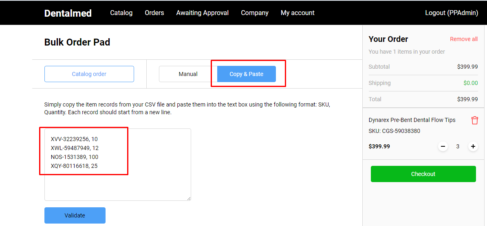
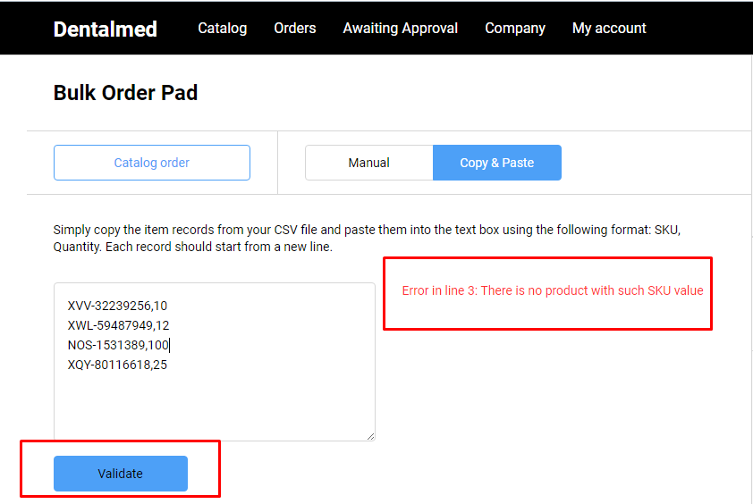
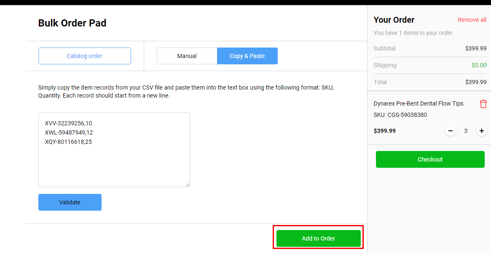

# Bulk Order

## Create a Bulk Order

The application allows the user to create a bulk order using two types:

1. Manual bulk order
1. Copy & Paste

### Manual Bulk Order

1. The user clicks the 'Bulk Order' button on 'Catalog' page;
1. The system opens the Bulk Order Pad. The Manual Bulk Order will be displayed by default;
1. The user can select to enter products using one of the following ways:

        1. The user enters the product SKU into the correspondent field
        1. The system displays the product name automatically; **OR**:
        1. The user enters the product name
        1. The system displays the product SKU automatically. 
1. The user clicks the 'Add to Order' button and the selected items will be added to the Active Order;
1. The 'Checkout' button is active.

### Copy & Paste

1. The user navigates to 'Copy & Paste' tab, enters the product SKUs and product quantity into the text box and clicks the 'Validate' button;
1. The system will validate the entered data:

        1. If the entered SKUs are correct and product quantity is available in store, no error messages will be displayed; The 'Add to Order' button will be available;
        1. If any of the entered product SKUs are not correct or product quantity not available in store, the system will display an error message and the 'Add to Order button' will not be available. 

1. The user clicks the 'Add to Order' button;
1. The selected products will appear in the Active Order.

