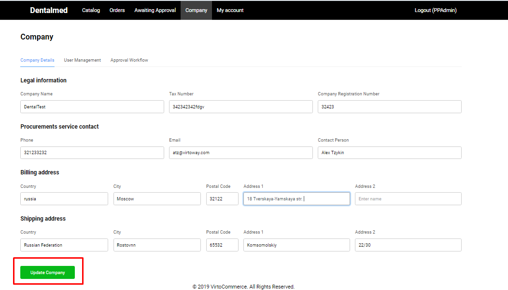

# Edit Company Details

The Company Details tab contains the following fields that should be filled out:

Under legal Information:

1. Company Name;
1. Tax Number;
1. Company Registration Number.

Under Procurement Service Contact:

1. Phone;
1. Email;
1. Contact Person.

Under Shipping Address:

1. Country;
1. City;
1. postal Code;
1. Address 1;
1. Address 2.

All fields are editable.

