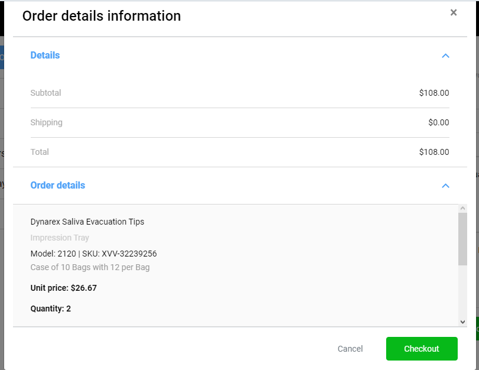
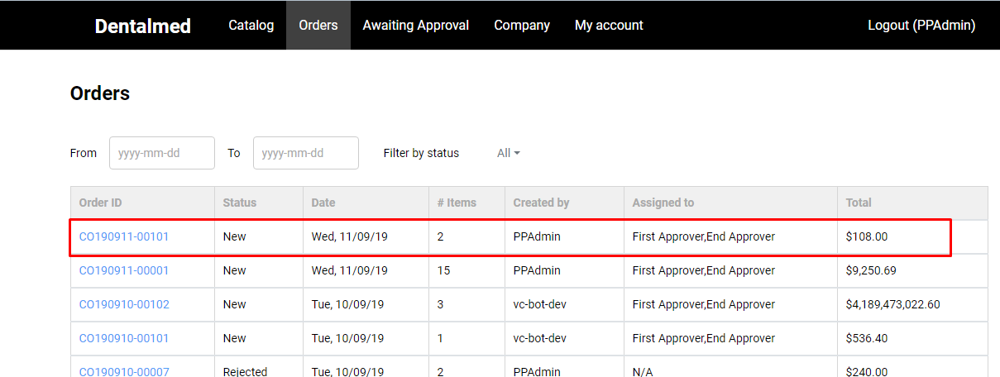

# Order Checkout

## Order checkout with Approval workflow

1. The user adds the products to Active order and clicks the 'Checkout' button;
1. The system will display the Order 'Order Details Information' pop-up window;
1. The user confirms the checkout;
1. The Active order will be moved to 'Orders' page as 'New' and the approval chain according to the approval workflow will be displayed.

## Checkout without Approval workflow

1. The user adds the products to Active order and clicks the 'Checkout' button;
1. The system will display the Order 'Order Details Information' pop-up window;
1. The user confirms the checkout;
1. The system will generate an invoice.
