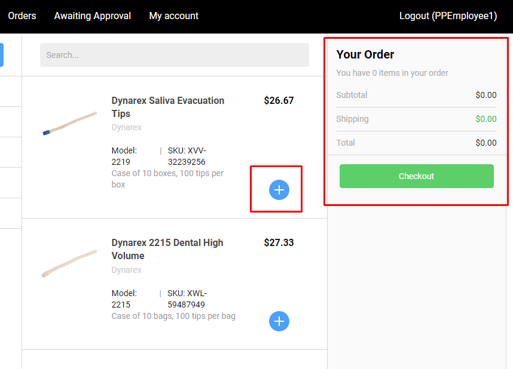
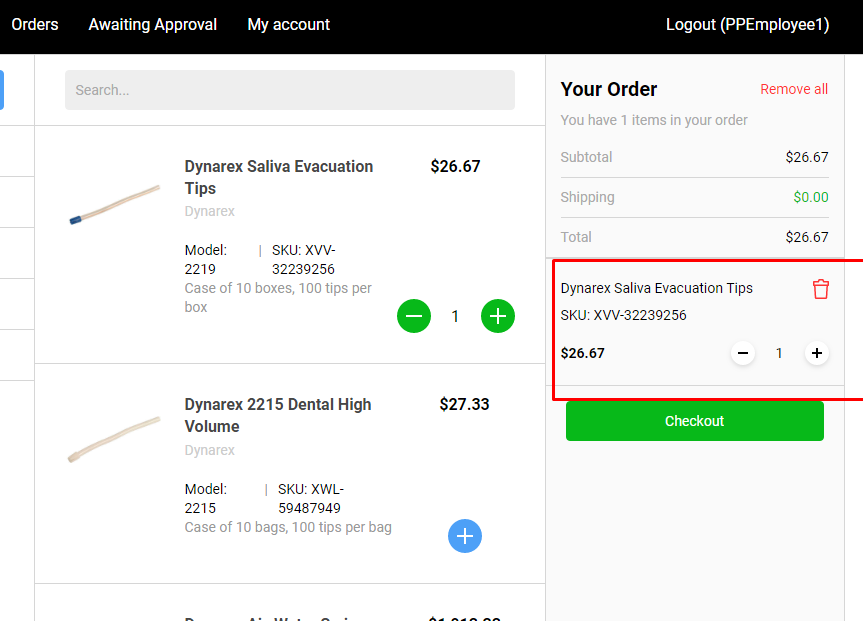

# Remove Products from Active Order

1. The user clicks the '-' button either on the Catalog page, or in the Active order;
1. The number of the product will be reduced both on page and in Active Order;
1. Clicking the '-' button when there is only one item in the Active order will result in removing the product from the Active order;
1. Clicking the 'Remove All' button will result in removing all the added products from the Active Order.

