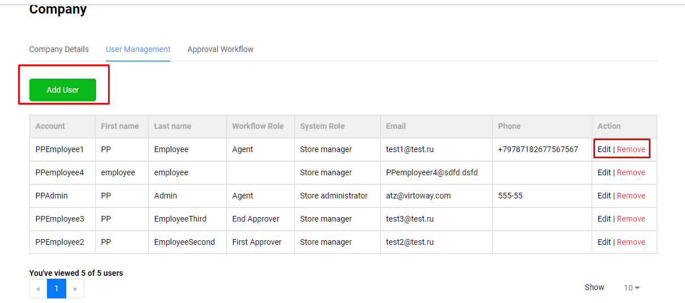
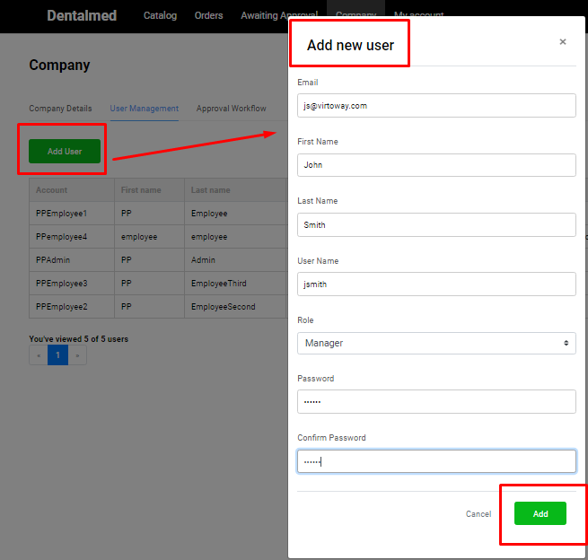
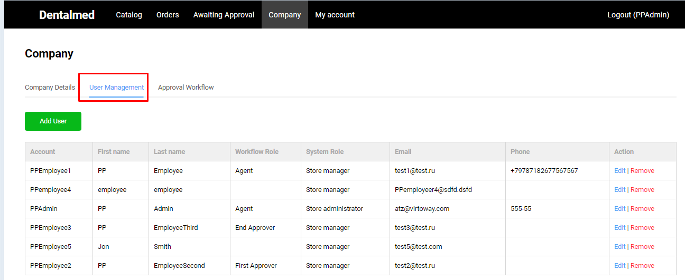
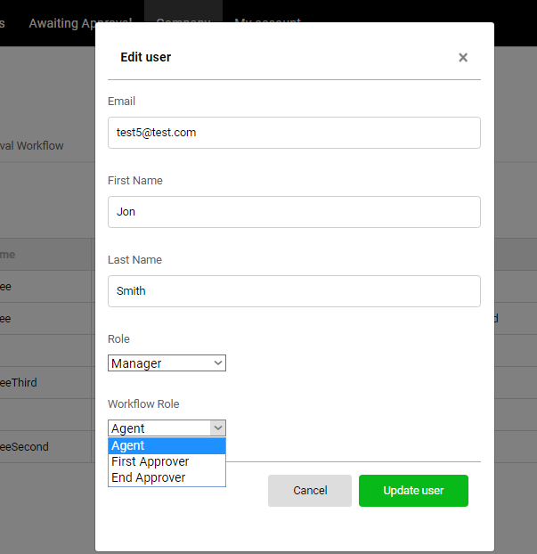
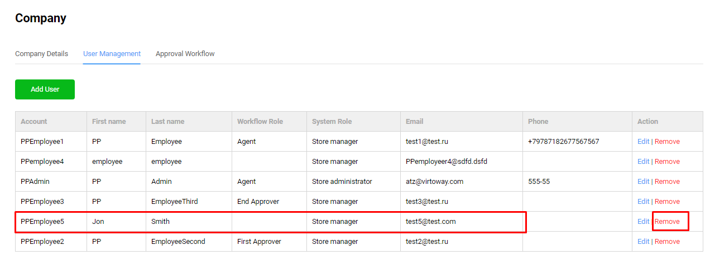
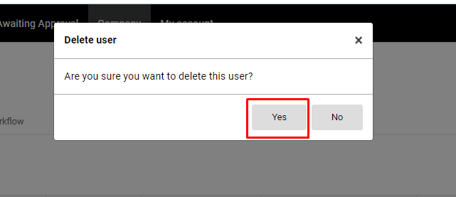

# User Management tab

On User Management tab the admin can add/edit and remove users. Also the admin can assign a role with specific set of permissions to each company user.

## Add New User

1. The admin navigates to User management tab and clicks the 'Add User' button;
1. The system displays the 'Add New User' window 
1. The admin fills out the fields and clicks the 'Add' button;
1. A new user will be created and added to the Users list.

## Edit User

1. Select the user and click 'Edit' button in the same row;
1. Update the user details in the opened 'Edit User' window and click 'Update user';
1. The system will update the user information accordingly.

## Remove User

The admin can remove any user from the list of users simply by selecting the user and clicking the 'Remove' button in the same row. 

The system will prompt the admin to confirm user deletion

The admin confirms the user deletion and the user will be deleted from the list of users.

## Approval Workflow
